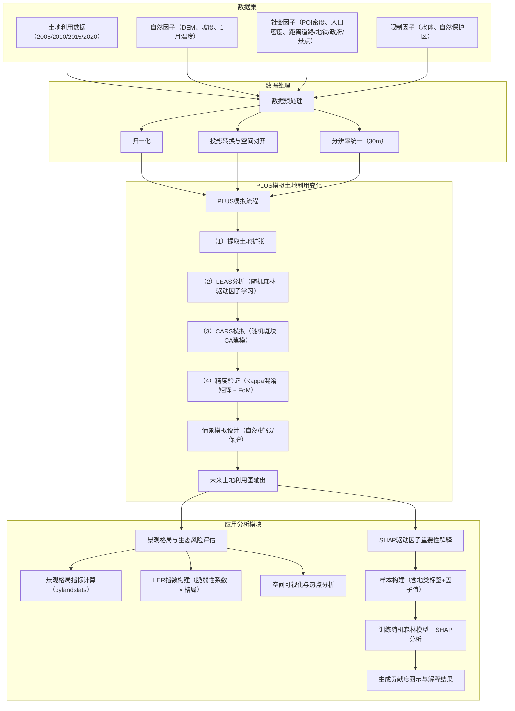

## 城市土地利用变化如何影响生态风险？——基于PLUS模型的佛山市案例研究

基于PLUS模型的城市土地利用变化模拟与生态风险评估研究—以佛山市为例

## 研究技术流程图（概念设计）

---

## 完善修改版方案要点

### 一、生态风险指数（LER）计算公式与方法

1. **LER公式**：
   LER（k单元）按如下公式计算：

$$
LER_k = \sum_{i=1}^{n} \left(\frac{A_{ik}}{A_k} \cdot R_i \cdot F_{ik}\right)
$$

其中：

* $A_{ik}$：第k网格中第i类土地面积
* $A_k$：第k网格总面积
* $R_i$：第i类土地的生态脆弱性系数（见下文）
* $F_{ik}$：景观破碎度（如Patch Density、LSI）

2. **（脆弱性系数设置推荐）**：

| 土地类型 | $R_{i}$ 值 |
|----------|--------|
| 林地     | 0.2    |
| 湿地     | 0.2    |
| 水域     | 0.3    |
| 草地     | 0.4    |
| 农田     | 0.6    |
| 灌木     | 0.5    |
| 荒地     | 0.8    |
| 城市建设用地 | 1.0 |

1. **格网划分设计**：

* 网格单位大小建议为 **500m × 500m**，兼顾城市精度与计算量；佛山约为15,000网格。
* 使用python工具在ArcGIS/QGIS中生成格网，并与土地利用栅格叠加。

4. **景观指数计算建议**：
   使用 `pylandstats` 库计算指标，如：

* Patch Density (PD)
* Edge Density (ED)
* Landscape Shape Index (LSI)
* Shannon Diversity Index (SHDI)
* Largest Patch Index (LPI)

---

### 二、SHAP分析补充设计

#### 背景

PLUS模型在LEAS模块中调用随机森林进行因子贡献度计算，输出为每类地物的平均重要性矩阵，无法显示“各样本下不同因子的非线性影响”。

#### 如果要用SHAP进行补充分析

1. **数据来源**：

* 输入特征：PLUS中使用的全部驱动因子（已标准化）
* 输出标签：某一类土地的变化（布尔型，是否从非X转变为X，如“是否转为建设用地”）
* 特征构建方式：可提取LEAS分析区域中的采样点（x, y）及其驱动因子值，结合变化前后土地类型标记标签。

2. **建模方法**：

* 模型：随机森林分类器（sklearn）
* 特征解释：SHAP（TreeExplainer）

3. **输出**：

* 各因子对建设用地扩张/耕地消失的贡献程度
* SHAP条形图/力图（Force Plot）/依赖图（Dependence Plot）

---

## 推荐使用的工具软件

| 工具名称           | 用途            |
| -------------- | ------------- |
| PLUS           | 土地利用模拟（含随机森林） |
| pylandstats    | 景观格局指数计算      |
| Python         | 空间数据处理与渔网生成   |
| sklearn + shap | 机器学习与特征解释分析   |

---
